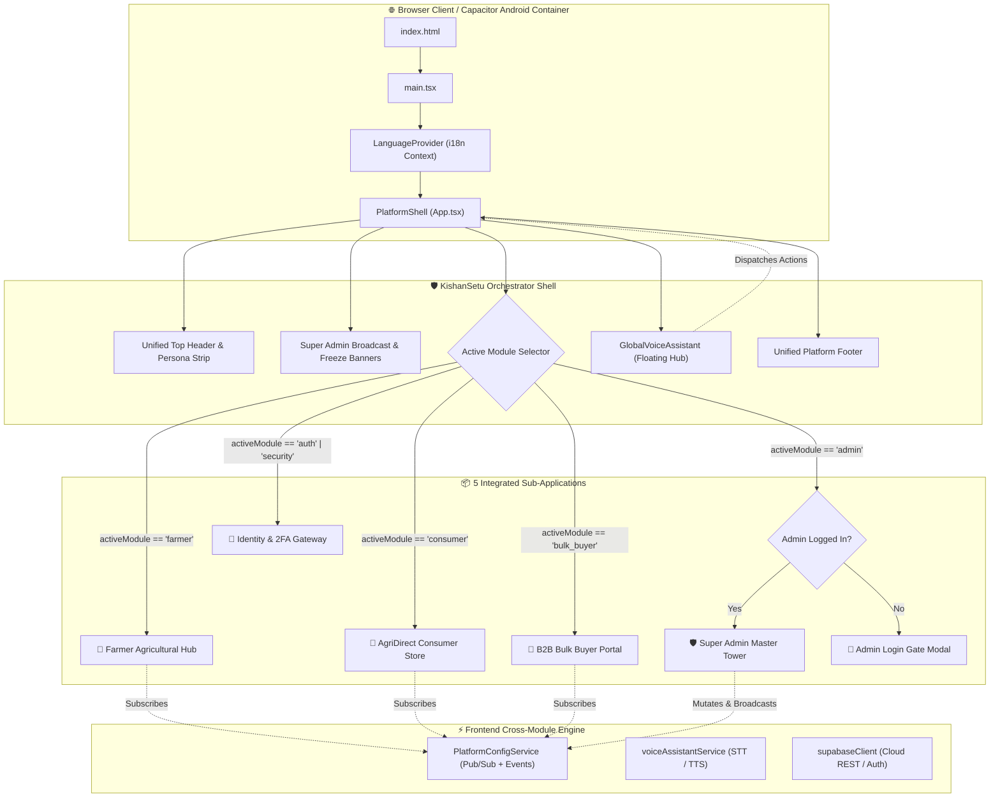
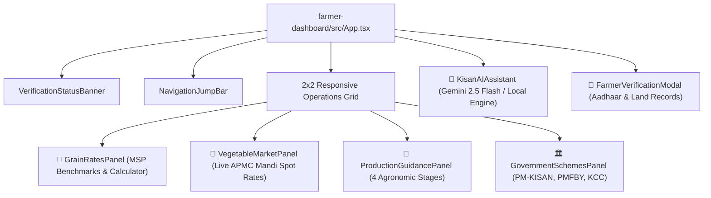
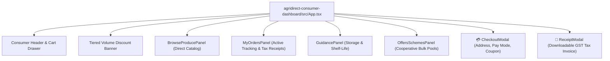
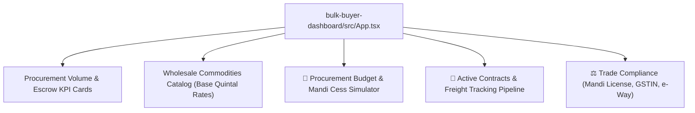
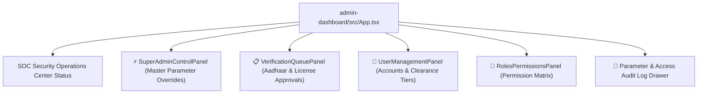
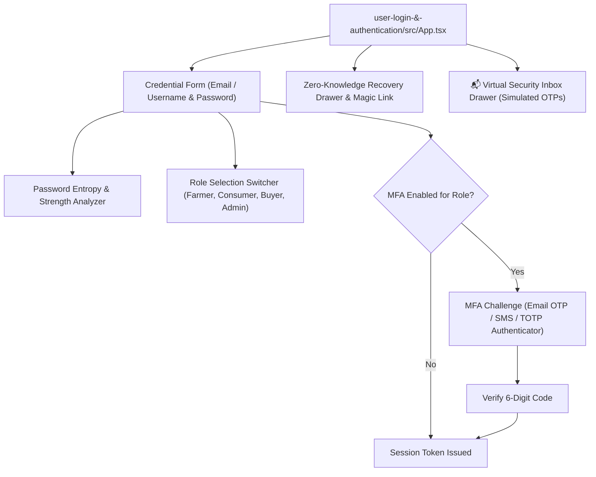
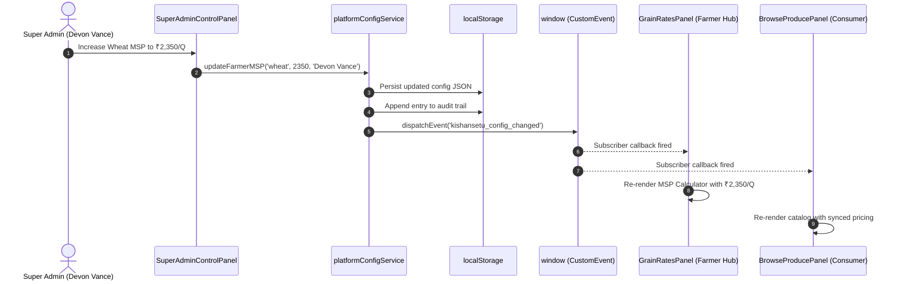

# 🌾 KishanSetu - Frontend Architecture & Application Workflow

This document provides an exhaustive, production-grade breakdown of the frontend architecture, component hierarchy, state management, UI/UX systems, and execution workflows across all **5 integrated modules** of the **KishanSetu** ecosystem.

---

## 🏛️ 1. High-Level Frontend Architecture

KishanSetu is built on **React 19** and **Vite 6**, styled with **Tailwind CSS v4**, and modularized using clean TypeScript path aliases. The application operates as a **Unified Single-Page Application (SPA)** that hosts 5 specialized sub-applications under a central orchestration shell.

---

## 🧩 2. Core Orchestrator Shell (`src/App.tsx`)

The root orchestrator component (`PlatformShell`) maintains global platform state and provides a cohesive experience across disparate modules:

### 2.1 State Variables in `PlatformShell`
- `currentUser: UserAccount | null`: Current active authenticated user persona. Synchronized with `localStorage['kishansetu_active_user']`.
- `activeModule: ModuleType`: Active visible sub-application (`'auth' | 'farmer' | 'consumer' | 'bulk_buyer' | 'admin' | 'security'`).
- `theme: 'light' | 'dark'`: Unified theme mode persisted in `localStorage['kishansetu_theme']` and synchronized via custom DOM event `kishansetu_theme_changed`.
- `platformConfig: PlatformConfig`: Real-time administrative parameter snapshot received from `platformConfigService`.
- `isMobileMenuOpen: boolean`: Responsive drawer toggle for small screen devices.
- `isSupabaseModalOpen: boolean`: Status and diagnostics modal for Supabase Cloud integration.
- `showSplash: boolean`: Introductory branding splash animation on startup.

### 2.2 Global Navigation & Persona Switcher
The top navigation bar contains:
1. **Live Highway Status Strip**: Indicator badge showing real-time connectivity, Supabase Cloud modal trigger, and persona switcher pills.
2. **Quick Persona Switcher**: Instant identity toggling between 4 verified personas:
   - **Ramesh Patel** (Farmer)
   - **Priya Sharma** (Retail Consumer)
   - **Vikram Singhania** (B2B Bulk Buyer)
   - **Devon Vance** (Super Administrator - requires Master Password if accessing Admin Console)
3. **Language Selection Trigger**: Multi-lingual selector modal trigger displaying the current active language in native script.
4. **Universal Light/Dark Toggle**: High-contrast theme switcher with Sun/Moon icons.
5. **Super Admin Live Announcement Banner**: Reactive alert banner dynamically colored by severity (`info`, `warning`, `emergency`).
6. **Emergency Price Freeze Strip**: High-priority alert locking spot market fluctuations across all trading tables.

---

## 📦 3. Deep Dive: The 5 Integrated Sub-Modules

### 🌾 Module 1: Farmer Agricultural Hub (`farmer-dashboard`)
Designed specifically for agricultural producers, offering tools to maximize harvest value, access subsidies, and interact with AI advisors.

#### Key Capabilities:
- **MSP Grain Calculator (`GrainRatesPanel.tsx`)**:
  - Displays high-resolution photographic crop image thumbnails with seasonal badges for Wheat, Paddy (Common/Grade A), Maize, Mustard, Gram, and Pearl Millet.
  - Displays official Minimum Support Prices for Wheat (₹2,275/Q), Paddy (₹2,183/Q), Mustard (₹5,650/Q), Gram, Maize, and Bajra.
  - Dynamically recalculates gross farmer revenue based on input quintals or kilograms.
  - Automatically updates when the Super Admin modifies rates in the Control Tower.
- **Vegetable Mandi Benchmarks (`VegetableMarketPanel.tsx`)**:
  - Displays high-resolution fresh vegetable image thumbnails with arrival badges (High/Moderate/Low) for Potato, Onion, Tomato, Cauliflower, Cabbage, and Green Peas.
  - Live modal prices for Agra (Potato), Lasalgaon (Onion), Kolar (Tomato), Jabalpur (Peas), Guntur (Chilli).
  - Price change indicators (Green/Red) and historical trend graphs.
- **Scientific Production Guides (`ProductionGuidancePanel.tsx`)**:
  - 4 scientific stages: Soil Preparation, CRI Stage Irrigation (20-25 days), Organic Pest Protection (Neem Azadirachtin 1500ppm), Post-Harvest Storage (<12% moisture).
- **Official Aadhaar KYC Desk (`FarmerVerificationModal.tsx`)**:
  - Farmers submit masked Aadhaar number, state, district, landholding in acres, and upload Jamabandi/land records.
  - Generates verifiable **Kisan ID** upon approval by Admin.
- **Kisan Sahayak AI Assistant (`KisanAIAssistant.tsx`)**:
  - Multilingual conversational interface supporting **8 languages**: Hindi, English, Hinglish, Punjabi, Marathi, Gujarati, Bengali, Telugu.
  - Audio speech synthesis, mic dictation, and contextual awareness of current entered harvest data.

---

### 🛒 Module 2: AgriDirect Consumer Store (`agridirect-consumer-dashboard`)
A direct farm-to-table consumer marketplace eliminating middlemen and delivering fresh produce to households.

#### Key Capabilities:
- **Dynamic Tiered Bulk Pricing**:
  - **Tier 1 (≥25 kg)**: Automatic **8% discount** applied to cart.
  - **Tier 2 (≥100 kg Quintal)**: Automatic **15% discount** applied to cart.
- **Produce Catalog (`BrowseProducePanel.tsx`)**:
  - Real-time stock status, harvest date tags, certified organic badges, and farmer cooperative provenance.
- **Checkout & Digital Receipts (`CheckoutModal.tsx`, `ReceiptModal.tsx`)**:
  - Address validation, promo coupon engine (`KISHAN10`, `FRESHFARM`), delivery fee calculation (Free above ₹499 threshold).
  - Downloadable printable official tax invoice with dispatch timestamps.
- **Step-by-Step Order Tracking (`MyOrdersPanel.tsx`)**:
  - Visual status progress: *Placed -> Confirmed -> Harvested -> Dispatched -> Out for Delivery -> Delivered*.

---

### 🏢 Module 3: B2B Wholesale Procurement Portal (`bulk-buyer-dashboard`)
Wholesale institutional trading engine for agro-processors, flour mills, exporters, and large-scale retail chains.

#### Key Capabilities:
- **3-Tier Volume Discount Matrix**:
  - Tier 1: 50–100 Quintals (3% discount)
  - Tier 2: 100–250 Quintals (6% discount)
  - Tier 3: 250+ Quintals (10% discount)
- **APMC Mandi Cess & Transit Insurance Calculator**:
  - Automatically calculates statutory **APMC Mandi Cess (1.5%)**, **Transit Freight Insurance (0.8%)**, and **Platform Escrow Lock (0.5%)**.
- **Institutional Contract Pipeline**:
  - Full lifecycle tracking: *PO Generated -> Assaying & Grading -> Escrow Funded -> Freight Dispatched -> Mandi Weighbridge Clear -> Settled*.
- **Trade Compliance Verification**:
  - Integrated validation for APMC license numbers, GSTIN registration, and e-Way bills.

---

### 🛡️ Module 4: Super Admin Control Tower (`admin-dashboard`)
The command center with Level 5 Root Clearance to oversee platform security, inspect KYC queues, and dynamically reconfigure live economic parameters.

#### Key Capabilities:
- **Master Control Tower (`SuperAdminControlPanel.tsx`)**:
  - Overrides MSP benchmarks, mandi prices, retail produce prices, consumer bulk discount thresholds, delivery fees, and promo coupons.
  - Adjusts B2B bulk base rates, APMC cess percentages, and transit insurance surcharges.
  - Sets security policies: Mandatory MFA per role, failed login lockout counts, lockout duration.
  - Controls global emergency switches: **Emergency Price Freeze**, **Global Announcement Banner**, and **Maintenance Mode**.
  - One-click **Factory Reset** to restore official government benchmarks.
- **Aadhaar KYC Verification Queue (`VerificationQueuePanel.tsx`)**:
  - Inspects pending farmer Aadhaar cards and corporate mandi licenses.
  - Side-by-side document modal with high-resolution inspection.
  - One-click **Approve** (issues official Kisan ID `KS-STATE-DIST-YYYY-XXXX`) or **Reject** with formal reviewer feedback notes.
- **Role-Based Access Control (RBAC)**:
  - Dynamic permission toggles across 4 user clearance levels.

---

### 🔑 Module 5: User Login & Security Gateway (`user-login-&-authentication`)
Central identity management, credential validation, multi-factor authentication, and security audit engine.

#### Key Capabilities:
- **Multi-Factor Authentication (MFA)**:
  - Supports 3 verification channels: Email 6-digit OTP, SMS Mobile passcode, and TOTP Authenticator apps (Google Authenticator, Microsoft Authenticator, Authy).
- **Virtual Security Inbox Drawer**:
  - In development and demonstration mode, simulated OTP codes and magic login links are routed into an interactive slide-over inbox in the bottom right corner of the screen.
- **Password Entropy Analyzer**:
  - Real-time password evaluation checking length, lowercase, uppercase, numerals, special characters, and dictionary vulnerability score.
- **Live Security Audit Trail**:
  - Logs IP address, timestamp, browser user-agent, action (`LOGIN_SUCCESS`, `MFA_CHALLENGE`, `PASSWORD_RESET`), and status.

---

## 🌐 4. Cross-Cutting Frontend Systems

### 4.1 Real-Time Pub/Sub Parameter Engine (`platformConfigService.ts`)
The platform implements a reactive Publisher/Subscriber pattern using browser `CustomEvent` and `localStorage` synchronization. When the Super Admin updates any parameter in the Admin Console:
1. `platformConfigService.updateConfig(category, updates, author)` executes.
2. The new configuration is serialized to `localStorage['kishansetu_platform_config']`.
3. A timestamped audit entry is logged to `kishansetu_config_audit_log`.
4. A custom DOM event `'kishansetu_config_changed'` is dispatched.
5. All active subscriber components across all mounted modules instantly receive the updated state and trigger React re-renders without requiring a page reload.

---

### 4.2 Universal Light & Dark Mode Theming Engine
KishanSetu implements an ecosystem-wide dark/light theme system:
- Root HTML element class toggling: `document.documentElement.classList.toggle('dark', isDark)`.
- Persisted in `localStorage['kishansetu_theme']`.
- Tailwind CSS v4 custom variant: `@custom-variant dark (&:where(.dark, .dark *));`.
- Scoped theme variables with guaranteed 100% contrast ratios for all table headers, cards, typography, and charts in both light and dark palettes.

---

### 4.3 Multilingual i18n Translation Engine (`LanguageContext.tsx`)
The platform includes built-in localization across **9 Indian languages**:

| Code | Language | Script | Native Name |
| :--- | :--- | :--- | :--- |
| `hi` | Hindi | Devanagari | हिन्दी |
| `en` | English | Latin | English |
| `hinglish`| Hinglish | Latin Conversational | Hinglish |
| `pa` | Punjabi | Gurmukhi | ਪੰਜਾਬੀ |
| `mr` | Marathi | Devanagari | मराठी |
| `gu` | Gujarati | Gujarati | ગુજરાતી |
| `bn` | Bengali | Bengali | বাংলা |
| `te` | Telugu | Telugu | తెలుగు |
| `ta` | Tamil | Tamil | தமிழ் |

Translations are managed via `LanguageContext` providing the `t(key, fallback)` helper function. A dedicated `LanguageSelectionModal` prompts first-time visitors to choose their preferred dialect.

---

### 4.4 Global Voice Assistant (`GlobalVoiceAssistant.tsx`, `voiceAssistantService.ts`)
A hands-free agricultural voice companion and navigation engine:
- **Speech-to-Text (STT)**: Uses the HTML5 `webkitSpeechRecognition` / `SpeechRecognition` API with language-specific BCP 47 locale mapping (e.g., `hi-IN`, `pa-IN`, `en-IN`).
- **Speech Synthesis (TTS)**: Clean markdown-to-speech audio converter via `SpeechSynthesisUtterance`.
- **Hybrid Intent Parser**:
  - First routes transcripts to `/api/ai/voice-command` for high-speed local regex pattern execution.
  - If unhandled, calls Gemini 2.5 Flash cloud intent analyzer.
  - If network is unavailable, executes offline client-side fallback via `agriKnowledgeBase.ts`.
- **Voice Capabilities**:
  - Voice Navigation: *"Open consumer store"*, *"Go to farmer hub"*, *"Admin console"*.
  - Voice Controls: *"Turn on dark mode"*, *"Switch to Hindi"*, *"Show 2x2 grid"*.
  - Agricultural Inquiries: *"What is the MSP of wheat?"*, *"Check potato mandi price"*.
