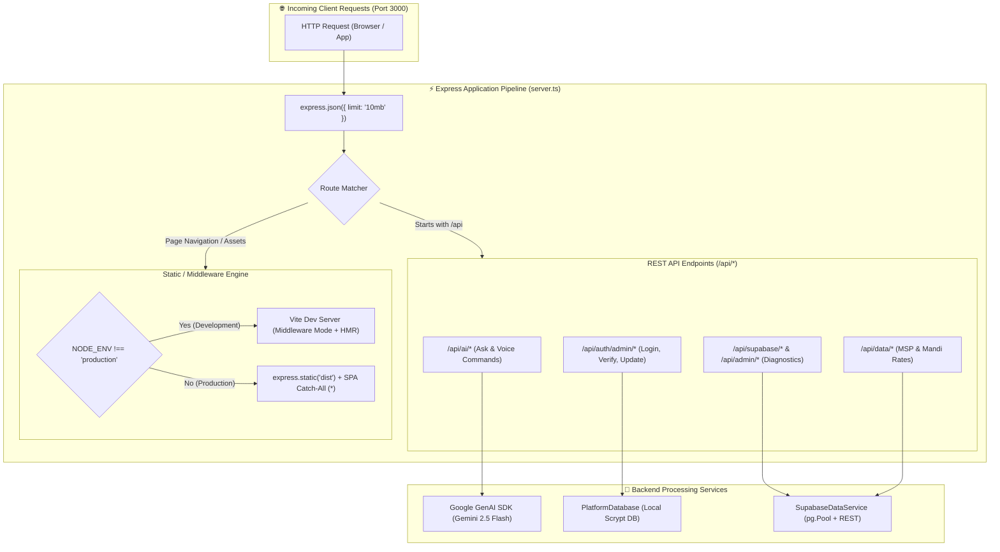
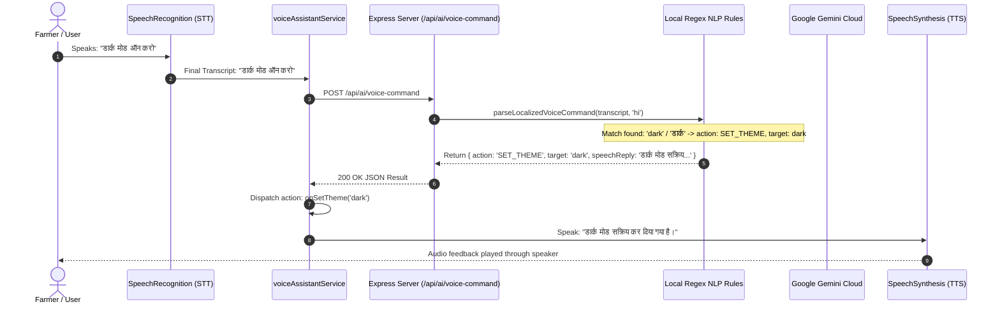
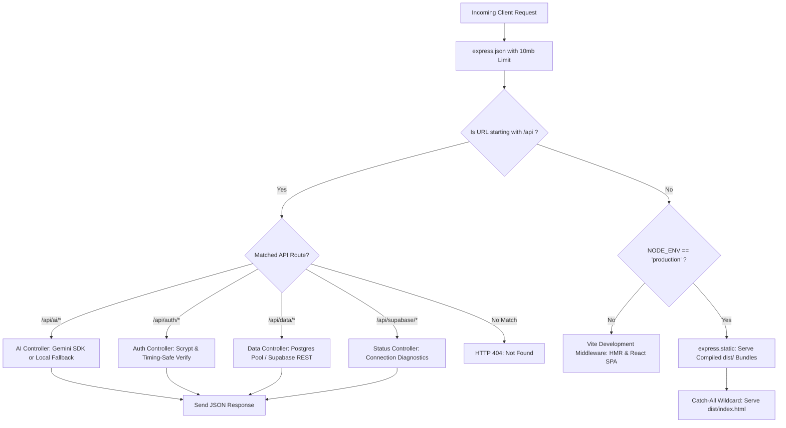

# ⚙️ KishanSetu - Backend & Server Workflow

This document provides a comprehensive technical reference for the server architecture, Express middleware pipeline, API routing, real-time AI gateways, session management, and service orchestration in **KishanSetu**.

---

## 🏛️ 1. Server Architecture & Operational Modes

The KishanSetu backend is driven by **Node.js (v18+)** and **Express 4.21**, written in **TypeScript**. In development it runs via `tsx`, and for production deployment it compiles into a high-performance ES module bundle via `esbuild`.



### 1.1 Development Mode vs Production Mode

| Capability | Development Mode (`npm run dev`) | Production Mode (`npm start`) |
| :--- | :--- | :--- |
| **Execution Command** | `tsx server.ts` | `node dist/server.js` |
| **Frontend Serving** | Vite Dev Middleware (`createServer({ server: { middlewareMode: true } })`) | Static files via `express.static(path.join(process.cwd(), 'dist'))` |
| **Hot Module Replacement (HMR)** | Active; instant CSS/TSX hot reloading without server restart | Disabled; serves pre-compiled and minified assets |
| **SPA Fallback Routing** | Handled natively by Vite's HTML middleware | Explicit Express catch-all: `app.get('*', (req, res) => res.sendFile('dist/index.html'))` |
| **Unified Port** | Single port (`http://localhost:3000`) for both API endpoints and UI | Single port (`http://localhost:3000`) |

---

## 🛣️ 2. Complete REST API Reference & Request Workflows

### 2.1 AI & Natural Language Processing Endpoints

#### 1. `POST /api/ai/ask`
Powers the **Kisan Sahayak** agricultural conversational assistant.
- **Payload**:
  ```json
  {
    "question": "What is the official MSP for Wheat and how much for 25 quintals?",
    "history": [
      { "role": "user", "text": "Namaste" },
      { "role": "model", "text": "Ram Ram Kisan bhai! How can I help you today?" }
    ],
    "context": {
      "totalCalculatedEarnings": {
        "grainMspTotal": 56875,
        "vegetableMandiTotal": 21750,
        "grandTotal": 78625
      }
    },
    "language": "hi"
  }
  ```
- **Internal Logic**:
  1. Checks for configured `GEMINI_API_KEY`.
  2. If key exists, constructs a role-specific agricultural prompt with strict guidelines:
     - Responds in the exact chosen language (e.g., Devanagari Hindi, Gurmukhi Punjabi, Telugu script).
     - Addresses the farmer respectfully (*"राम राम किसान भाई! 🙏"*).
     - Breaks down unit conversions (1 Quintal = 100 kg) with step-by-step arithmetic.
     - Calls `gemini-2.5-flash` (with automatic fallback to `gemini-1.5-flash` if unavailable).
  3. If `GEMINI_API_KEY` is omitted or quota is exceeded, executes the **Built-in Localized Knowledge Engine** (`buildLocalizedDashboardAnswer`), delivering high-fidelity, contextual answers based on active dashboard state without crashing.
- **Response**:
  ```json
  {
    "reply": "राम राम किसान भाई! 🙏\n\nगेहूं का सरकारी न्यूनतम समर्थन मूल्य ₹2,275 प्रति क्विंटल...",
    "source": "gemini_cloud_live" // or "localized_engine"
  }
  ```

---

#### 2. `POST /api/ai/voice-command`
Real-time spoken command interpreter for hands-free voice navigation and actions.
- **Payload**:
  ```json
  {
    "transcript": "उपभोक्ता स्टोर खोलो",
    "language": "hi",
    "currentModule": "farmer",
    "apiKey": "optional_custom_user_key"
  }
  ```
- **Execution Flow**:
  1. **Tier 1 (Instant Local NLP)**: Matches transcript against regex/keyword dictionary in `parseLocalizedVoiceCommand`. Immediately parses navigation (`consumer`, `bulk_buyer`, `admin`, `farmer`), themes (`dark`, `light`), languages (`hi`, `en`, `pa`), and panels (`grain`, `vegetable`, `orders`). Execution latency: `< 2ms`.
  2. **Tier 2 (Gemini Cloud NLP)**: If transcript is a complex or ambiguous sentence, invokes Gemini 2.5 Flash with structured JSON output schema:
     ```json
     {
       "action": "NAVIGATE_MODULE" | "FOCUS_PANEL" | "SET_THEME" | "SET_LANGUAGE" | "GENERAL",
       "target": "consumer",
       "speechReply": "उपभोक्ता स्टोर खोला जा रहा है।",
       "displayText": "उपभोक्ता स्टोर पर नेविगेट किया गया"
     }
     ```
  3. **Tier 3 (Offline Knowledge Engine)**: Returns safe fallback response if network fails.



---

### 2.2 Security & Admin Database Endpoints

#### 3. `POST /api/auth/admin/login`
Authenticates Super Administrators against the local cryptographically secure database.
- **Payload**:
  ```json
  {
    "userId": "admin",
    "password": "Admin@KishanSetu2026"
  }
  ```
- **Internal Security Steps**:
  1. Retrieves user record by username or email from `PlatformDatabase`.
  2. Verifies account role is strictly `'admin'`.
  3. Computes password hash using `crypto.scryptSync(password, user.salt, 64)`.
  4. Compares stored hash with candidate hash using constant-time comparison `crypto.timingSafeEqual` (defends against timing attacks).
  5. Updates `lastLogin` timestamp on success.
  6. Creates a 24-hour cryptographic session token (`ks_adm_sess_<64_hex_chars>`).
  7. Records audit entry: `ADMIN_LOGIN_SUCCESS`.
- **Response**:
  ```json
  {
    "success": true,
    "token": "ks_adm_sess_9a8b7c6d5e...",
    "user": {
      "id": "usr_admin_001",
      "username": "admin",
      "email": "admin@kishansetu.in",
      "name": "Super Admin Devon Vance",
      "role": "admin",
      "roleMeta": { "clearanceLevel": "Root Clearance (Level 5)" }
    }
  }
  ```

---

#### 4. `GET /api/auth/admin/verify`
Validates administrative authorization tokens for privileged requests.
- **Headers**: `Authorization: Bearer <token>`
- **Logic**: Looks up session in `platformDb.verifySession(token)`. Ensures token is present, active, and has not exceeded its 24-hour expiration window.
- **Response**: `{ "valid": true, "user": { ... } }` or HTTP 401 Unauthorized.

---

#### 5. `POST /api/auth/admin/update-credentials`
Allows the Super Administrator to change their Master Username, Email, and Master Password.
- **Payload**:
  ```json
  {
    "currentPassword": "Admin@KishanSetu2026",
    "newUsername": "superadmin",
    "newPassword": "NewSecurePassword#2026",
    "newEmail": "devon.vance@agriportal.gov"
  }
  ```
- **Logic**: Authorizes change with `currentPassword`. Generates a fresh 16-byte random salt, computes new scrypt hash, updates `database.json` atomically, and writes an audit log.

---

#### 6. `GET /api/admin/db-status`
Diagnostics endpoint returning database health metrics:
- **Response**:
  ```json
  {
    "status": "ONLINE",
    "dbPath": "d:\\kishansetu\\data\\database.json",
    "totalUsers": 4,
    "totalSessions": 1,
    "totalAuditLogs": 12,
    "adminConfigured": true,
    "adminUsername": "admin",
    "adminLastLogin": "2026-09-17T06:15:00.000Z",
    "updatedAt": "2026-09-17T06:15:00.000Z"
  }
  ```

---

### 2.3 Supabase Cloud & Market Data Endpoints

#### 7. `GET /api/supabase/status`
Tests and reports live database connectivity:
- **Execution**: Evaluates connectivity using a 3-tier priority waterfall:
  1. Direct PostgreSQL 17 connection pool (`pg.Pool` via `process.env.DATABASE_URL`). Runs `SELECT NOW() as db_time, version() as version;` and measures latency in milliseconds.
  2. Supabase REST Client (`checkSupabaseHealth()`).
  3. Local Storage Fallback.
- **Response**:
  ```json
  {
    "provider": "SUPABASE_POSTGRESQL_CLOUD",
    "activeMode": "Supabase Cloud Live (PostgreSQL 17)",
    "supabase": {
      "configured": true,
      "connected": true,
      "endpoint": "db.zbwpvedsulwjzbejynqa.supabase.co:5432",
      "latencyMs": 84,
      "serverTime": "2026-09-17T06:15:22.124Z",
      "version": "PostgreSQL 17.2",
      "timestamp": "2026-09-17T06:15:22.208Z"
    },
    "localDb": { "status": "ONLINE", "totalUsers": 4 },
    "timestamp": "2026-09-17T06:15:22.208Z"
  }
  ```

---

#### 8. `GET /api/data/msp-rates`
Returns official government Minimum Support Price benchmarks for key grains and oilseeds:
- **Source Priority**: Direct PostgreSQL Cloud -> Supabase REST Client -> In-Memory Fallback.
- **Dataset**: Wheat (₹2,275), Paddy Common (₹2,183), Paddy Grade A (₹2,203), Mustard (₹5,650), Gram (₹5,440), Maize (₹2,090), Bajra (₹2,500).

---

#### 9. `GET /api/data/mandi-rates`
Returns wholesale vegetable spot rates from major Indian APMC Mandis:
- **Source Priority**: Direct PostgreSQL Cloud -> Supabase REST Client -> In-Memory Fallback.
- **Dataset**: Agra (Potato), Lasalgaon (Onion), Kolar (Tomato), Jabalpur (Peas), Guntur (Chilli), Hapur (Cauliflower).

---

## 🛡️ 3. Request Lifecycle & Middleware Pipeline


