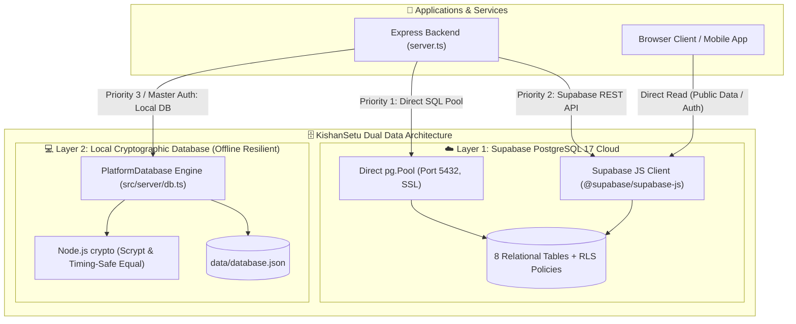
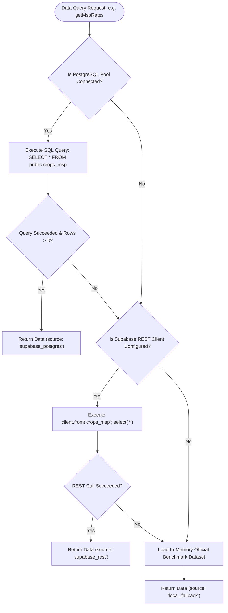

# 🗄️ KishanSetu - Database Architecture & Data Workflow

This document provides a comprehensive analysis of the database architecture in **KishanSetu**, covering the **Dual-Database Hybrid Architecture**, the **Local Cryptographic JSON Database**, the **Supabase PostgreSQL 17 Cloud Schema**, **Row-Level Security (RLS)**, and **Failover Lifecycles**.

---

## 🏛️ 1. Dual-Database Hybrid Architecture

To guarantee maximum resilience, offline operation, and enterprise cloud scalability, KishanSetu implements a **hybrid dual-layer data architecture**:



### Why a Hybrid Architecture?
1. **Zero-Downtime Guarantee**: If the cloud database is unconfigured or experiences network downtime, the system instantly and transparently falls back to local data stores without crashing or blocking user transactions.
2. **Offline Local Development**: Developers can clone the repository, run `npm run dev`, and immediately interact with the platform without requiring an active internet connection or cloud database provisioning.
3. **High Security for Master Administrator**: Master admin credentials and administrative audit sessions are persisted locally using salted scrypt cryptography, preventing external credential exfiltration.

---

## ☁️ 2. Supabase PostgreSQL 17 Cloud Schema

The cloud database is defined in `supabase/schema.sql` and consists of **8 relational tables** with UUID primary keys, foreign key constraints, and performance indexes.

### 2.1 Entity-Relationship Diagram (ERD)

```mermaid
erDiagram
    USERS ||--o{ FARMER_VERIFICATIONS : "submits"
    USERS ||--o{ PRODUCE_LISTINGS : "lists"
    USERS ||--o{ ORDERS : "places"
    USERS ||--o{ CONTRACTS : "participates_as_buyer_or_farmer"

    USERS {
        uuid id PK "uuid_generate_v4()"
        text username UK "Unique username"
        text email UK "Unique email"
        text name "Full legal name"
        text phone "Mobile number"
        text role "admin | farmer | consumer | bulk_buyer"
        text password_hash "Optional cloud password hash"
        text salt "Cryptographic salt"
        jsonb role_meta "Role specific attributes"
        boolean mfa_enabled "2FA status"
        text avatar_url "Profile avatar URL"
        timestamptz last_login "Last active timestamp"
        timestamptz created_at
        timestamptz updated_at
    }

    FARMER_VERIFICATIONS {
        uuid id PK "uuid_generate_v4()"
        uuid user_id FK "References users(id)"
        text farmer_name "Farmer full name"
        text aadhaar_masked "XXXX-XXXX-1234"
        text state "State name"
        text district "District name"
        text village "Village name"
        numeric land_size_acres "Total farm acreage"
        text_array crops_grown "Array of crop names"
        text kisan_id UK "Official certified Kisan ID"
        text status "PENDING | VERIFIED | REJECTED"
        jsonb documents "Uploaded document metadata"
        text reviewer_notes "Admin feedback"
        text verified_by "Admin officer name"
        timestamptz verified_at
        timestamptz created_at
    }

    CROPS_MSP {
        uuid id PK "uuid_generate_v4()"
        text crop_name "English crop name"
        text hindi_name "Hindi crop name"
        text category "Grain | Pulse | Oilseed | Cash Crop | Vegetable"
        numeric msp_rate "₹ per Quintal"
        text unit "Default: Quintal (100 kg)"
        text effective_year "e.g. 2025-26"
        timestamptz created_at
    }

    MANDI_RATES {
        uuid id PK "uuid_generate_v4()"
        text commodity "Vegetable / Produce name"
        text hindi_name "Hindi name"
        text market_name "e.g. Agra Mandi"
        text state "e.g. Uttar Pradesh"
        numeric min_price "Minimum wholesale rate"
        numeric modal_price "Modal benchmark rate"
        numeric max_price "Maximum wholesale rate"
        text unit "₹/Quintal"
        date price_date "Price recording date"
        timestamptz created_at
    }

    PRODUCE_LISTINGS {
        uuid id PK "uuid_generate_v4()"
        uuid farmer_id FK "References users(id)"
        text farmer_name "Farmer / Cooperative name"
        text title "Listing title"
        text category "Vegetables | Grains | Spices"
        numeric quantity_available "Available stock"
        text unit "kg | Quintal"
        numeric price_per_unit "Price per unit"
        text location "Harvest origin"
        date harvest_date "Date of harvesting"
        boolean organic_certified "Organic certification badge"
        text image_url "Produce image URL"
        text status "ACTIVE | SOLD_OUT | UNLISTED"
        timestamptz created_at
    }

    ORDERS {
        uuid id PK "uuid_generate_v4()"
        text order_number UK "e.g. KS-ORD-882190"
        uuid buyer_id FK "References users(id)"
        text buyer_name "Customer full name"
        text order_type "RETAIL_CONSUMER | BULK_CONTRACT"
        jsonb items "Array of ordered products"
        numeric total_amount "Total transaction amount"
        jsonb delivery_address "Shipping address"
        text payment_status "PENDING | PAID | FAILED | REFUNDED"
        text delivery_status "PLACED | CONFIRMED | DISPATCHED | DELIVERED | CANCELLED"
        timestamptz created_at
    }

    CONTRACTS {
        uuid id PK "uuid_generate_v4()"
        text contract_code UK "e.g. KS-B2B-2026-0042"
        uuid buyer_id FK "References users(id)"
        text buyer_name "Institutional buyer"
        uuid farmer_id FK "References users(id)"
        text farmer_name "Farmer cooperative"
        text crop_name "Commodity contracted"
        numeric quantity_metric_tons "Total tonnage (MT)"
        numeric agreed_price_per_ton "Agreed price per MT"
        numeric total_contract_value "Total contract valuation"
        numeric advance_paid "Escrow deposit"
        date delivery_deadline "Target delivery date"
        text quality_specs "Moisture, foreign matter, grading"
        text terms "APMC cess, transit insurance terms"
        text status "DRAFT | PENDING_APPROVAL | ACTIVE | FULFILLED | DISPUTED | CANCELLED"
        timestamptz created_at
    }

    AUDIT_LOGS {
        uuid id PK "uuid_generate_v4()"
        text action "ACTION_NAME"
        text actor "Username or IP"
        text details "Detailed action log"
        text ip_address "Origin IP"
        text status "SUCCESS | FAILED | WARNING"
        timestamptz created_at
    }
```



---

### 2.2 Row-Level Security (RLS) Policies

Supabase Row-Level Security is active on all tables to prevent unauthorized data access:

```sql
-- 1. Public Read Access for Market Data and Active Produce
CREATE POLICY "Public can view MSP rates" 
  ON public.crops_msp FOR SELECT USING (true);

CREATE POLICY "Public can view Mandi prices" 
  ON public.mandi_rates FOR SELECT USING (true);

CREATE POLICY "Public can view active produce listings" 
  ON public.produce_listings FOR SELECT USING (status = 'ACTIVE');

-- 2. Service Role & Platform Access
CREATE POLICY "Allow platform service read users" 
  ON public.users FOR SELECT USING (true);

CREATE POLICY "Allow platform service update users" 
  ON public.users FOR ALL USING (true);

CREATE POLICY "Allow platform verifications access" 
  ON public.farmer_verifications FOR ALL USING (true);

CREATE POLICY "Allow platform orders access" 
  ON public.orders FOR ALL USING (true);

CREATE POLICY "Allow platform contracts access" 
  ON public.contracts FOR ALL USING (true);

CREATE POLICY "Allow platform audit logs access" 
  ON public.audit_logs FOR ALL USING (true);
```

---

## 💻 3. Local Cryptographic Database Engine (`PlatformDatabase`)

Defined in `src/server/db.ts` and stored in `data/database.json`. It provides an enterprise-grade local data layer.

### 3.1 Security & Hashing Architecture
- **Scrypt Key Derivation**: Passwords are never stored in plaintext. They are hashed using `crypto.scryptSync(password, salt, 64)`.
- **Per-User Dynamic Salt**: Each user record contains an independently generated 16-byte cryptographically secure random salt (`crypto.randomBytes(16).toString('hex')`).
- **Timing-Safe Comparison**: Verification uses `crypto.timingSafeEqual` over buffers, completely preventing side-channel timing attacks.
- **Session Tokens**: Administrative sessions generate a 32-byte hex token (`ks_adm_sess_<64_hex_chars>`) with a strict 24-hour expiration window.

```mermaid
flowchart TD
    CandidatePassword[Candidate Password Input] --> FetchUser[Lookup User in database.json]
    FetchUser --> SaltFound[Extract Stored Salt]
    SaltFound --> ScryptHash["crypto.scryptSync(CandidatePassword, StoredSalt, 64)"]
    ScryptHash --> CandidateBuffer[Buffer.from(CandidateHash, 'hex')]
    FetchUser --> StoredBuffer[Buffer.from(StoredPasswordHash, 'hex')]
    CandidateBuffer --> TimingCompare{"crypto.timingSafeEqual(CandidateBuffer, StoredBuffer)"}
    StoredBuffer --> TimingCompare

    TimingCompare -->|Match (true)| AuthSuccess[Authentication Successful: Issue Session Token]
    TimingCompare -->|Mismatch (false)| AuthFail[Authentication Rejected: Log Failed Attempt]
```

### 3.2 Pre-Seeded Default Personas in `database.json`

| ID | Username | Role | Full Name | Default Password | Default 2FA |
| :--- | :--- | :--- | :--- | :--- | :--- |
| `usr_admin_001` | `admin` | `admin` | Super Admin Devon Vance | `Admin@KishanSetu2026` | Authenticator App |
| `usr_farmer_001` | `ramesh.farmer` | `farmer` | Ramesh Patel | `FarmerHarvest#2025` | SMS Code |
| `usr_consumer_001` | `priya.consumer` | `consumer` | Priya Sharma | `ConsumerFresh#2025` | Email OTP |
| `usr_bulk_001` | `vikram.bulkbuyer` | `bulk_buyer` | Vikram Singhania | `BulkTrading#2025` | Email OTP |

---

## 🔄 4. Database Connection & Failover Decision Tree

The `SupabaseDataService` (`src/server/supabaseService.ts`) handles query dispatching through a 3-tier waterfall:


