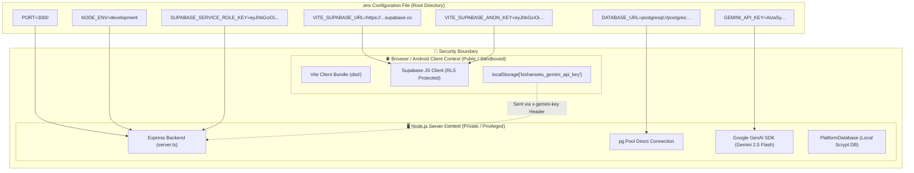
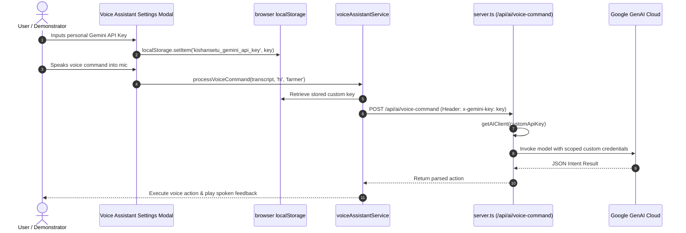

# 🔑 KishanSetu - API Keys, Secrets & Environment Configuration Workflow

This document provides a detailed security analysis and workflow guide for managing environment variables, API keys, database credentials, and secrets across the **KishanSetu** ecosystem.

---

## 🛡️ 1. Secrets Classification & Security Boundary

In modern web development, secrets must be strictly classified based on **execution context** (Browser Client vs. Node.js Backend Server). Exposing backend secrets to the frontend bundle creates critical vulnerabilities.



---

## 📋 2. Complete Environment Variables Matrix

| Variable Name | Execution Scope | Exposure | Required? | Purpose & Security Controls |
| :--- | :--- | :--- | :--- | :--- |
| `PORT` | Node.js Backend | **Server Only** | Optional (Default: `3000`) | Network port on which the Express HTTP server listens. |
| `NODE_ENV` | Node.js Backend | **Server Only** | Recommended (`development` / `production`) | Toggles Vite middleware mode in development vs. compiled static bundle serving in production. |
| `GEMINI_API_KEY` | Node.js Backend | **Server Only (NEVER Expose)** | Optional (Graceful fallback) | API Key obtained from [Google AI Studio](https://aistudio.google.com/) to power Gemini 2.5 Flash for the agricultural companion and voice parsing. |
| `VITE_SUPABASE_URL` | Browser + Server | **Public Safe** | Optional | The HTTPS endpoint of your Supabase Cloud project (e.g., `https://xyz.supabase.co`). Prefix `VITE_` allows Vite to bundle it to the client. |
| `VITE_SUPABASE_ANON_KEY` | Browser + Server | **Public Safe (RLS Enforced)** | Optional | Supabase public anonymous token. Safe in client code because all database queries are constrained by PostgreSQL Row-Level Security (RLS). |
| `SUPABASE_SERVICE_ROLE_KEY` | Node.js Backend | **Server Only (NEVER Expose)** | Optional | Elevated master API key for administrative server-side operations that bypasses Row-Level Security. |
| `DATABASE_URL` | Node.js Backend | **Server Only (NEVER Expose)** | Optional | Full PostgreSQL connection URI for high-performance direct pooling via `pg.Pool` over SSL (Port 5432 / 6543). |

---

## 🔄 3. Dual-Layer Key Resolution Workflow

KishanSetu is engineered with a **Universal Environment Resolver** (`src/services/supabaseClient.ts`) that functions seamlessly across both Browser (Vite `import.meta.env`) and Node.js (`process.env`):

```mermaid
flowchart TD
    Start([getEnvVar called with key]) --> CheckVite{Does import.meta.env exist?}
    CheckVite -->|Yes (Browser / Vite)| ReadVite[Read import.meta.env[key]]
    ReadVite --> ValidVite{Is value non-empty string?}
    ValidVite -->|Yes| ReturnVite[Return trimmed value]
    ValidVite -->|No| CheckProcess

    CheckVite -->|No| CheckProcess{Does process.env exist?}
    CheckProcess -->|Yes (Node.js Server)| ReadProcess[Read process.env[key]]
    ReadProcess --> ValidProcess{Is value non-empty string?}
    ValidProcess -->|Yes| ReturnProcess[Return trimmed value]
    ValidProcess -->|No| ReturnEmpty[Return empty string '']

    CheckProcess -->|No| ReturnEmpty
```

---

## 🤖 4. Dynamic User Gemini API Key Injection Flow

In addition to server-level `.env` configuration, KishanSetu supports **Dynamic User API Key Injection**:
- Individual agricultural researchers, extension officers, or demonstration evaluators can bring their own Gemini API key.
- The key is saved locally in browser `localStorage['kishansetu_gemini_api_key']` via `voiceAssistantService.ts`.
- When dispatching voice commands, the key is passed either in the HTTP header `x-gemini-key` or in the request body.
- The server lazily instantiates a scoped `GoogleGenAI` client for that specific request, ensuring user keys are never stored on the server disk.



---

## 🛡️ 5. Security & Deployment Best Practices

1. **Git Protection (`.gitignore`)**:
   - The `.env` file is strictly ignored in `.gitignore`.
   - Only `.env.example` (containing empty placeholder values) is committed to version control.
2. **Graceful Fallbacks**:
   - If `GEMINI_API_KEY` is omitted, the platform does **not crash**. It automatically activates the localized in-memory agricultural fallback engine.
   - If `VITE_SUPABASE_URL` is omitted, the platform activates the offline local database engine (`database.json`).
3. **Prevention of Accidental Exfiltration**:
   - The backend server validates placeholder strings (e.g. `your-project-id`, `your-anon-key`) and safely treats them as unconfigured rather than throwing network exceptions.
