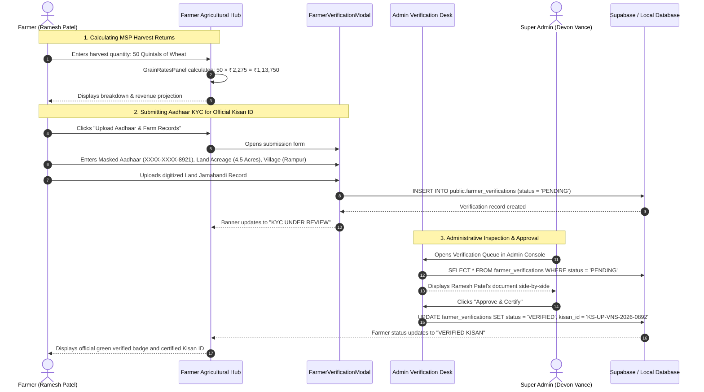
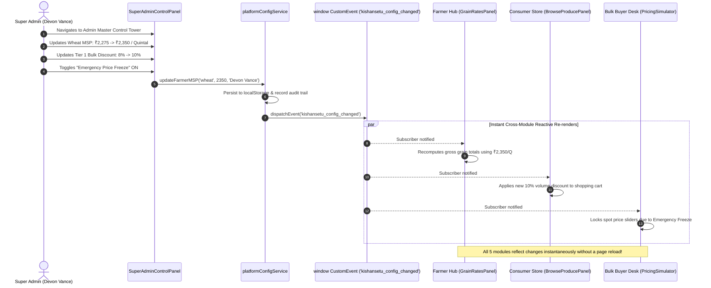
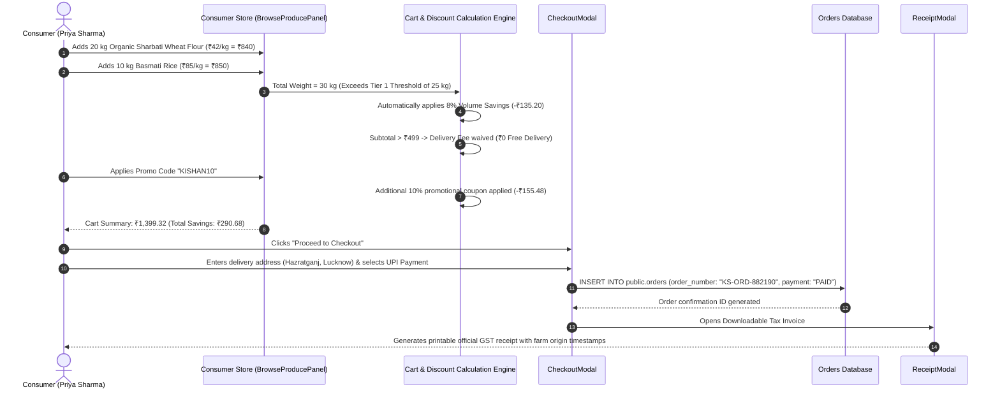
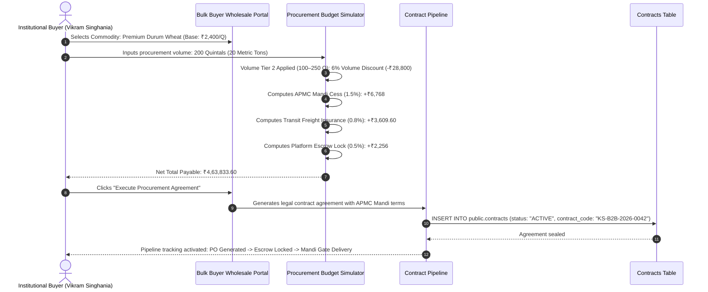
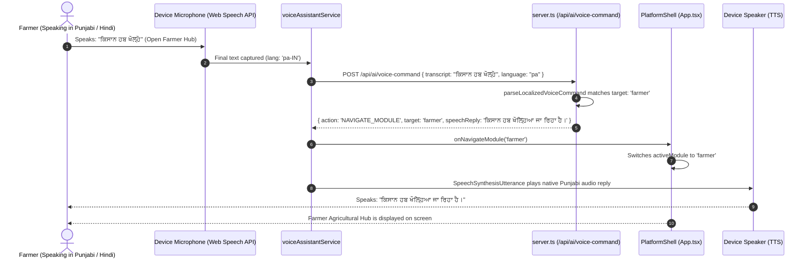

# 🔄 KishanSetu - End-to-End System & User Workflows

This document maps out the end-to-end operational workflows for each user role, detailing exact interactions, state mutations, and reactive event flows across the **KishanSetu** ecosystem.

---

## 🌾 Workflow 1: Farmer Agricultural Operations & KYC Verification

---

## ⚡ Workflow 2: Super Admin Real-Time Hot-Reloading Parameter Override

---

## 🛒 Workflow 3: Consumer Direct Farm-to-Table Ordering & Bulk Discount

---

## 🏢 Workflow 4: B2B Wholesale Institutional Procurement Contract

---

## 🤖 Workflow 5: Multilingual Voice Assistant & Real-Time Navigation

