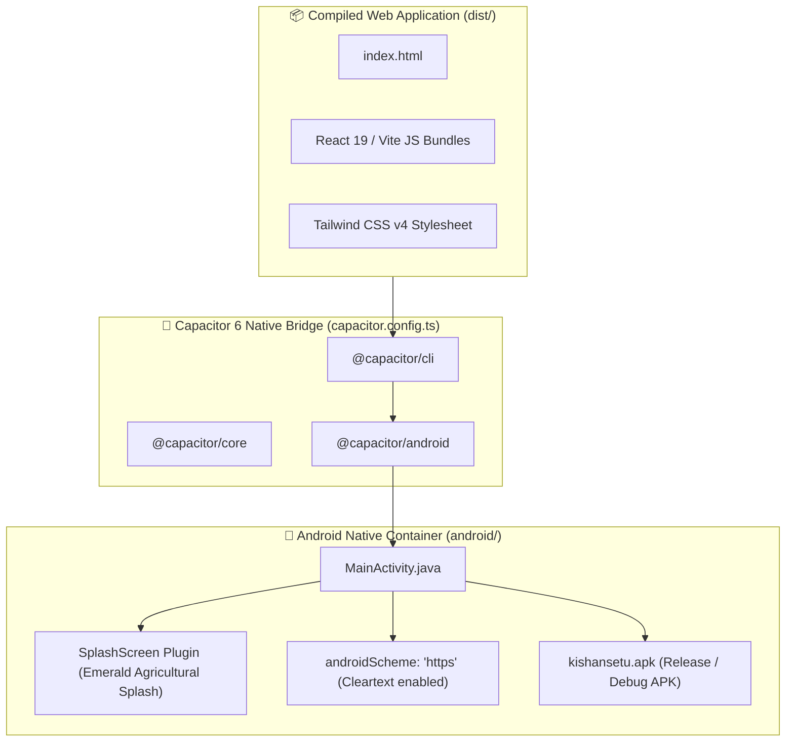
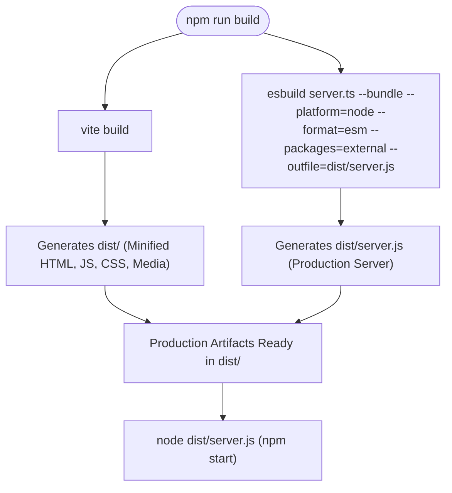

# 📱 KishanSetu - Mobile App Packaging & Production Deployment Workflow

This document provides complete instructions and architectural workflows for packaging the **KishanSetu Android Mobile App (APK)** with **Capacitor 6**, building production bundles, executing the automated test suite, and deploying to cloud infrastructure.

---

## 📱 1. Mobile Android Architecture (Capacitor 6)

KishanSetu is fully configured as a cross-platform mobile application utilizing **Capacitor 6**. The web application runs within a hardware-accelerated Android WebView with direct access to native APIs:



### 1.1 Capacitor Configuration (`capacitor.config.ts`)
```typescript
import type { CapacitorConfig } from '@capacitor/cli';

const config: CapacitorConfig = {
  appId: 'com.kishansetu.app',
  appName: 'KishanSetu',
  webDir: 'dist',
  server: {
    androidScheme: 'https',
    cleartext: true
  },
  plugins: {
    SplashScreen: {
      launchShowDuration: 2000,
      launchAutoHide: true,
      backgroundColor: '#064e3b',
      androidSplashResourceName: 'splash',
      androidScaleType: 'CENTER_CROP',
      showSpinner: false
    }
  }
};

export default config;
```

### 1.2 Android Build & Sync Commands
```bash
# 1. Build web application and synchronize web assets into the Android native project
npm run cap:build

# 2. Synchronize plugins and assets without rebuilding web app
npm run cap:sync

# 3. Open project in Android Studio for native emulation, debugging, or signing
npm run cap:open
```

---

## 🏗️ 2. Production Build Pipeline

The production build pipeline compiles both the frontend client and the backend Node.js server into standalone artifacts:



1. **Vite Bundler**: Compiles React 19 JSX, tree-shakes dead code, generates code-split chunks, and minifies CSS using Tailwind CSS v4.
2. **esbuild Server Bundler**: Bundles `server.ts` into a lightweight, high-performance ES module (`dist/server.js`) while keeping Node.js packages external.
3. **Execution**: `npm start` executes `node dist/server.js`, hosting both API routes and static frontend bundles on port `3000`.

---

## 🧪 3. Automated Test Suite & Quality Assurance

KishanSetu features a comprehensive automated verification suite:

```bash
# Run all tests sequentially
npm test
```

### Breakdown of Test Suites

| Test File | Target System | Verifications Performed |
| :--- | :--- | :--- |
| `tests/platformConfig.test.ts` | **Super Admin Control Tower** | Parameter mutations, pub/sub subscribers, cross-module synchronization, audit logging, and factory resets. |
| `tests/adminAuthDb.test.ts` | **Database & Cryptography** | Salt generation, Scrypt password hashing, constant-time buffer matching, session creation, and brute-force rejection. |
| `tests/supabaseService.test.ts` | **Cloud Database & Resiliency** | Connection health checks, direct PostgreSQL queries, Supabase REST queries, and automatic local fallback. |
| `tests/voiceAssistant.test.ts` | **Voice Assistant & NLP Engine** | Language locale mapping, regex voice intent parsing, and local knowledge base fallback. |

---

## ☁️ 4. Cloud Deployment (Render / VPS / Docker)

### 4.1 Deployment on Render (`render.yaml`)
KishanSetu includes native deployment configuration for [Render](https://render.com):

```yaml
services:
  - type: web
    name: kishansetu-platform
    env: node
    plan: standard
    buildCommand: npm install && npm run build
    startCommand: npm start
    envVars:
      - key: NODE_ENV
        value: production
      - key: PORT
        value: 3000
      - key: GEMINI_API_KEY
        sync: false
      - key: VITE_SUPABASE_URL
        sync: false
      - key: VITE_SUPABASE_ANON_KEY
        sync: false
```

### 4.2 Deployment on Linux VPS with PM2 & Nginx
```bash
# 1. Clone and install dependencies
git clone <repository-url> /var/www/kishansetu
cd /var/www/kishansetu
npm install

# 2. Build for production
npm run build

# 3. Start with PM2 Process Manager
pm2 start dist/server.js --name "kishansetu" --env production
pm2 save
pm2 startup
```
