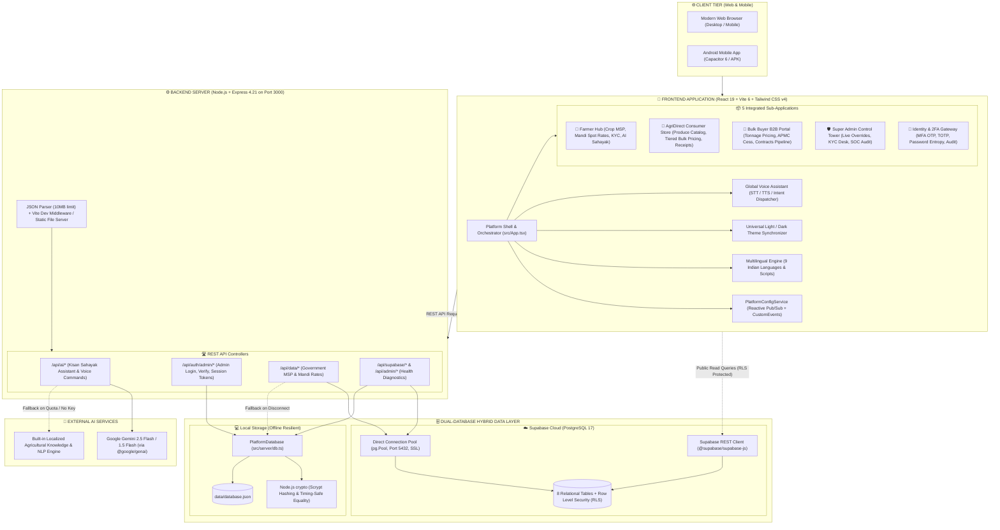

# 🌾 KishanSetu (किसान सेतु) - Master Workflow & Architecture Documentation

Welcome to the comprehensive workflow and system architecture documentation suite for **KishanSetu** (National Digital Agricultural Highway & Direct Farm Marketplace).

This directory contains in-depth documentation covering **every layer** of the KishanSetu ecosystem: Frontend, Backend, Server, Database, Cryptography, API Keys, System Workflows, Mobile Packaging, and Cloud Deployment.

---

## 🏛️ Master System Architecture Diagram



---

## 📑 Detailed Documentation Index

To explore any subsystem in depth, navigate to the dedicated documents below:

| # | Document | Target Audience | Key Contents Covered |
| :---: | :--- | :--- | :--- |
| **01** | [**Frontend Architecture & Workflow**](file:///d:/kishansetu/workflow/01_frontend_architecture_and_workflow.md) | Frontend Devs, UI/UX, QA | • React 19 & Vite 6 architecture<br>• Breakdown of all 5 modules<br>• Real-time reactive Pub/Sub parameter engine<br>• Universal Light/Dark theme synchronizer<br>• Multilingual i18n translation system (9 languages)<br>• Global voice assistant (STT / TTS) |
| **02** | [**Backend & Server Workflow**](file:///d:/kishansetu/workflow/02_backend_and_server_workflow.md) | Backend Devs, DevOps | • Express 4.21 pipeline & dual-mode execution<br>• Complete REST API reference with payloads<br>• Gemini 2.5 Flash AI Assistant integration<br>• Real-time multi-tier voice command parsing<br>• Administrative authentication & session verification |
| **03** | [**Database Architecture & Workflow**](file:///d:/kishansetu/workflow/03_database_architecture_and_workflow.md) | Database Admins, Data Engineers | • Dual-database hybrid architecture<br>• Supabase PostgreSQL 17 schema (8 tables)<br>• Complete Entity-Relationship Diagram (ERD)<br>• Row-Level Security (RLS) policies<br>• Local cryptographic database (`database.json`) with scrypt<br>• 3-tier connection failover waterfall |
| **04** | [**API Keys & Environment Workflow**](file:///d:/kishansetu/workflow/04_api_keys_and_environment_workflow.md) | SecOps, System Admins | • Secrets classification & security boundaries<br>• Environment variable matrix (`.env` vs `.env.example`)<br>• Universal environment variable resolver<br>• Dynamic user Gemini API key injection flow<br>• Accidental exfiltration prevention |
| **05** | [**End-to-End System & User Workflows**](file:///d:/kishansetu/workflow/05_end_to_end_system_workflows.md) | Product Managers, QA, Engineers | • Farmer harvest calculation & Aadhaar KYC submission<br>• Super Admin real-time parameter hot-reloading<br>• Consumer direct ordering & dynamic bulk discount<br>• B2B bulk institutional procurement contract flow<br>• Hands-free multilingual voice navigation |
| **06** | [**Mobile & Deployment Workflow**](file:///d:/kishansetu/workflow/06_mobile_and_deployment_workflow.md) | DevOps, Mobile Devs, Release Leads | • Capacitor 6 Android mobile app architecture<br>• APK build and synchronization commands<br>• Standalone production build (`vite` + `esbuild`)<br>• Automated verification test suite (`npm test`)<br>• Cloud deployment guides (Render, VPS, PM2) |

---

## ⚡ Quick Reference Commands

```bash
# 1. Run Unified Development Environment (Port 3000)
npm run dev

# 2. Run Automated Verification Test Suite
npm test

# 3. Build Production Bundles (Frontend + Server)
npm run build

# 4. Run Production Server
npm run start

# 5. Build & Synchronize Android Mobile App (Capacitor)
npm run cap:build
npm run cap:open
```

---

## 🔑 Pre-Seeded Default Verification Credentials

| Persona | Role | Username / Email | Default Password | Verification Channel |
| :--- | :--- | :--- | :--- | :--- |
| 🌾 **Farmer** | `farmer` | `ramesh.farmer@agriportal.in` | `FarmerHarvest#2025` | SMS Code |
| 🛒 **Consumer** | `consumer` | `priya.consumer@freshmart.in` | `ConsumerFresh#2025` | Email OTP |
| 🏢 **Bulk Buyer** | `bulk_buyer` | `vikram.bulkbuyer@agritraders.com` | `BulkTrading#2025` | Email OTP |
| 🛡️ **Super Admin** | `admin` | `admin` / `admin@kishansetu.in` | `Admin@KishanSetu2026` | Authenticator App |
